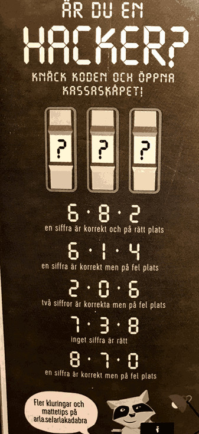

# Puzzle solutions

Here I plan to put source code that solves puzzles I happen to come across.

## Arla - Are you a hacker?

Arla sells milk, cheese and other dairy products. Sometimes they put puzzles on the back of milk packets. Like [this one](https://www.arla.se/49f09c/globalassets/aktuellt/mjolkbaksidor/2018/april/matte-hacker-april-2018-arlakadabra.pdf).


Note. The steghide pwd for the image above is *arlakadabra*.

Goal: Figure out the 3-digit code.

Input:

```
6 8 2 - One digit correct in the right position
6 1 4 - One digit correct in the wrong position
2 0 6 - Two correct, both in the wrong position
7 3 8 - No digit correct
8 7 0 - One correct, wrong position
```

This is easy enough to solve in your head, but I started thinking about
how to solve it with a computer. My solution uses the [Z3 solver](https://github.com/Z3Prover/z3). Install the python bindings with:
```
pip install --user --upgrade z3-solver
```

Figuring out the rules was pretty tricky and it is surely possible to do in a more effective way than I did, with hairy logic.

Anyway, to use Z3 first import the module and declare the variables to use:

```python
from z3 import *

k1 = Int('k1')
k2 = Int('k2')
k3 = Int('k3')

s = Solver()
```

k1, k2, k3 are the three key digits that needs to be calculated.

The Z3 solver works by using *constraints*. First I added constraints to keep
the integers between 0 and 9:
```python
s.add(k1 >= 0, k1 <= 9)
s.add(k2 >= 0, k2 <= 9)
s.add(k3 >= 0, k3 <= 9)
```

Then comes the hairy logic. The all digits are wrong case is easiest.

```python
def all_wrong(a, b, c):
    s.add(k1 != a, k1 != b, k1 != c)
    s.add(k2 != a, k2 != b, k2 != c)
    s.add(k3 != a, k3 != b, k3 != c)
```

If I call for instance *all\_wrong(1, 2, 3)* it means neither 1, 2 nor 3 are present in the key. In this case the line s.add(k1 != a, k1 != b, k1 != c) says the first digit is neither 1, 2 nor 3. Then the same for the second and third digit.

The second least complicated case is where one digit is in the correct place and the other two are not present in the key:
```python
def one_right_rightplace(a, b, c):
    s.add(Or(
        And(k1 == a, k2 != a, k2 != b, k2 != c, k3 != a, k3 != b, k3 != c),
        And(k1 != a, k1 != b, k1 != c, k2 == b, k3 != a, k3 != b, k3 != c),
        And(k1 != a, k1 != b, k1 != c, k2 != a, k2 != b, k2 != c, k3 == c)))
```
Her the s.add() starts with an Or(). That means at least one of the constraints
inside the Or() statement must be true (satisfied). I added logic so that only
one of the And lines can be true at the same time. The first line says k1 is
a (the first number) while k2, k3 are neither of the three given numbers.
And so on. Look at [milksolver.py](milksolver.py) for the other cases, which
have even hairier logic.

After all constraints have been added, run the solver by calling:
```python
s.check()
```
If it returns *unsat* it means no solution was found. But if it returns
*sat* then a solution is available in s.model().

Note, several solutions might exist. check() only returns the first model
it can find that satisfies all added constraints. To get more solutions, try
s.check() in a loop and add constraints to make the found models invalid (after
they have been printed).

You can find the correct code by installing Z3 and running milksolver.py, by
calculating it in your head or by extracting the hidden data from arla.jpg (above).
